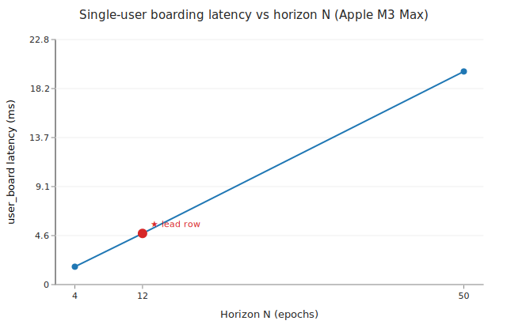
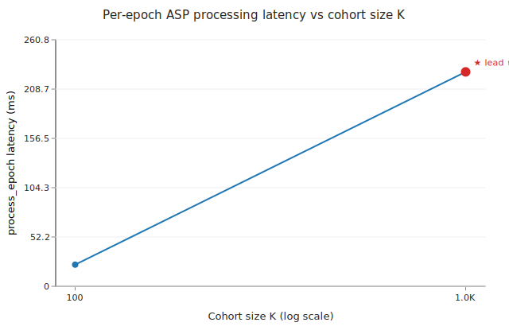
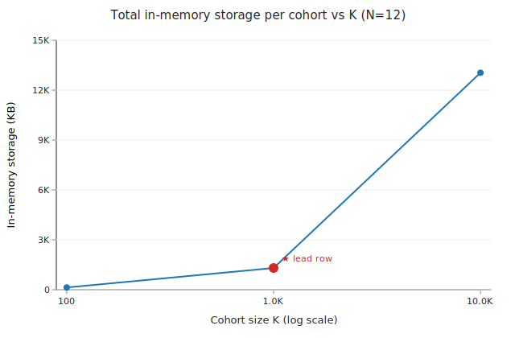

# Benchmarks

Top-level consolidator for the PSAR Phase 6 benchmark suite. Pulls
together the per-bench docs in `docs/benchmarks/` and the captured
plots in `docs/benchmarks/figures/`. The paper references this file
for the headline numbers and the supporting figures.

## Lead configuration

Throughout this document **(K=1000, N=12)** is the **lead row (★)** —
it represents the production-shape cohort the paper builds its
argument around. **(K=100, N=12)** is a secondary lead used in
isolated single-user contexts (e.g. boarding latency, where K does
not affect cost). Smaller / larger configurations are supplementary
data points that pin the scaling shape.

## Methodology

| Field             | Value                                       |
|-------------------|---------------------------------------------|
| Hardware          | Apple M3 Max (14 cores, 36 GB RAM)          |
| OS                | macOS 26.3.1 (Darwin 25.3.0)                |
| Toolchain         | rustc 1.95.0 (release profile, lto = false) |
| Criterion preset  | `--quick` (3 s measurement + 1 s warm-up)   |
| Sample size       | criterion default (100), overridden to 10 for `process_epoch/{100,1000}` due to per-iter cost |
| What's measured   | bench harnesses in `crates/dark-{von-musig2,psar}/benches/` + `psar-demo` runs |
| What's derived    | Arkade Delegation row in the comparison; `slot_attest_S` size formula (Nigiri-pending verification); cohort storage formula |

Linux / x86_64 numbers on `ubuntu-latest` typically run **1.5–2×
slower** for curve-arithmetic-heavy paths and similar for HMAC /
SHA-256. The envelopes in the threshold-sentinel tables in each
per-bench doc allow for this slack.

### Reproducibility

```bash
# Primitives (#681)
cargo bench -p dark-von-musig2 --bench partial_sign --bench aggregate -- --quick

# Boarding vs N (#682)
cargo bench -p dark-psar --bench boarding -- --quick

# Per-epoch vs K (#683); K=10000 stretch behind BENCH_LONG=1
cargo bench -p dark-psar --bench epoch -- --quick
BENCH_LONG=1 cargo bench -p dark-psar --bench epoch -- long

# Cohort scaling sweep (#684)
scripts/psar-scaling.sh --include-stretch

# On-chain footprint (#685, requires Nigiri)
nigiri start
scripts/psar-onchain.sh

# Plots (#687)
scripts/psar-plots.sh
```

### Raw data locations

| Bench / sweep             | Raw output                                                           |
|---------------------------|----------------------------------------------------------------------|
| Criterion HTML reports    | `target/criterion/{partial_sign,aggregate,user_board,process_epoch}/report/` |
| `psar-demo` JSON reports  | stdout (or `--report-path PATH`)                                     |
| Cohort scaling sweep      | `scripts/psar-scaling.sh --out PATH`                                 |
| On-chain measurements     | `scripts/psar-onchain.sh --out PATH`                                 |

## Headline numbers (lead row ★)

| Metric                                  | Value at lead row (K=1000, N=12) | Source doc |
|-----------------------------------------|-------------------------------------|----|
| User-side single-board latency (★ K=100)| **4.75 ms / user**                  | [psar-boarding.md](docs/benchmarks/psar-boarding.md) |
| ASP per-epoch latency                   | **226.8 ms** (227 µs / user)        | [psar-epoch.md](docs/benchmarks/psar-epoch.md)       |
| Total cohort wall-clock (board → 12 epochs → verify) | **9.0 s**             | [psar-scaling.md](docs/benchmarks/psar-scaling.md)   |
| In-memory storage per cohort            | **1.37 MB**                         | [psar-scaling.md](docs/benchmarks/psar-scaling.md)   |
| PSAR-specific L1 footprint per cohort   | **~201 vbytes** (slot_attest_S only)| [psar-onchain.md](docs/benchmarks/psar-onchain.md)   |
| User offline window                     | **N epochs after boarding**         | (design property, not a measurement) |

## Per-bench doc index

| Issue | Topic                                            | Doc                                               | Status                        |
|-------|--------------------------------------------------|---------------------------------------------------|-------------------------------|
| #681  | VON-MuSig2 cryptographic primitives              | [von-musig2-primitives.md](docs/benchmarks/von-musig2-primitives.md) | measured ✓ |
| #682  | Boarding latency vs N                            | [psar-boarding.md](docs/benchmarks/psar-boarding.md) | measured ✓ |
| #683  | Per-epoch ASP latency vs K                       | [psar-epoch.md](docs/benchmarks/psar-epoch.md)    | measured (K=10000 stretch behind `BENCH_LONG=1`) |
| #684  | Cohort scaling K × N                             | [psar-scaling.md](docs/benchmarks/psar-scaling.md) | measured ✓ |
| #685  | On-chain footprint                               | [psar-onchain.md](docs/benchmarks/psar-onchain.md) | analytic; measurement pending Nigiri run |
| #686  | PSAR vs Arkade Delegation v0.7.0                 | [psar-vs-arkade.md](docs/benchmarks/psar-vs-arkade.md) | derived from spec |
| —     | `dark-von` cryptographic primitives (Phase 1)    | [von-primitives.md](docs/benchmarks/von-primitives.md) | measured (already merged) |
| —     | `dark-confidential` primitives (earlier phase)   | [confidential-primitives.md](docs/benchmarks/confidential-primitives.md) | measured (already merged) |

## Figures

Three SVG figures, generated by `scripts/psar-plots.sh`:

### Boarding latency vs N (linear)



Linear in N: `user_board(N) ≈ 150 µs + N × 395 µs`. Lead row at
N=12 is 4.75 ms.

### Per-epoch ASP latency vs K (log-x)



Linear in K: per-user cost is **227 µs / user** stable across
K∈{100, 1000}. K=10000 stretch row pending (`BENCH_LONG=1`).

### In-memory storage vs K at N=12 (log-x)



Storage formula: `186K + 98KN + 292N + 180` bytes. Lead row at
K=1000 is 1.37 MB; K=10000 fits comfortably at 13.6 MB.

## Cross-protocol comparison (#686)

PSAR's headline win against Arkade Delegation v0.7.0 is **online-time
asymmetry**, not raw signing speed. PSAR pre-signs N renewals at
boarding so the user is offline for the entire horizon, at the cost
of ~1.4 MB of ASP storage and ~4 ms of upfront boarding cost. Arkade
keeps the user-side cost smaller per renewal but requires a trusted
delegator (Fulmine) online at every renewal.

See [psar-vs-arkade.md](docs/benchmarks/psar-vs-arkade.md) for the
full table with explicit assumptions A1–A6 (each Arkade cell is
footnoted to its source). Numbers in that doc are **derived from
spec** for the Arkade column — the limitations section makes this
explicit.

## Threshold sentinels (summary)

| Bench                                      | Envelope (Apple M-series)        | Notes                             |
|--------------------------------------------|-----------------------------------|-----------------------------------|
| `partial_sign/operator`                    | ≤ 100 µs                          | measured 45 µs                    |
| `partial_sign_participant_horizon/N`       | linear in N, slope ≤ 230 µs/epoch | measured ~225 µs/epoch            |
| `aggregate/2of2`                           | ≤ 50 µs                           | measured 20 µs                    |
| `user_board/12`                            | ≤ 10 ms                           | measured 4.75 ms                  |
| `process_epoch/100`                        | ≤ 50 ms                           | measured 22.9 ms                  |
| `process_epoch/1000`                       | ≤ 500 ms                          | measured 226.8 ms                 |
| `(K=1000, N=12)` cohort wall-clock (lead) ★ | ≤ 60 s                           | measured 9.0 s                    |

If any of these regress past the envelope on a future change, fail
the review and investigate before merging.
